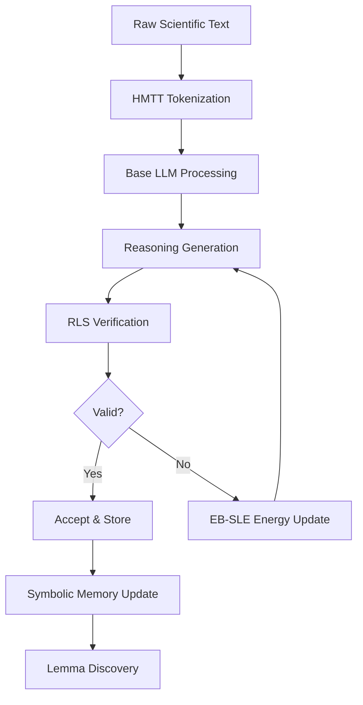

# Ananta — A Scientific Reasoning LLM

<div align="center">

**An experimental research-driven LLM system focused on scientific reasoning, symbolic mathematics, and formal logic**

[](https://www.python.org/downloads/)
[](LICENSE)
[](https://github.com/Prigoistic/ananta-oss)

</div>

---

## 🎯 Project Vision

Ananta aims to construct the **first open-source, verifiable, self-learning scientific LLM**, capable of:

- ✅ Solving PhD-level mathematics and physics problems
- ✅ Generating fully correct, stepwise derivations
- ✅ Discovering new lemmas and mathematical relations
- ✅ Autoformalizing scientific papers into formal logic
- ✅ Creating new scientific hypotheses grounded in symbolic verification

**Core Philosophy:** Go beyond typical transformer-based language models by constructing a hybrid architecture that understands symbolic math deeply, produces correct reasoning steps, verifies its own reasoning using logic, reduces hallucination, learns recursively, and evolves toward self-improving AI.

---

## 🏗️ System Architecture

Ananta consists of three major subsystems working in harmony:

### 1. **HMTT — Hybrid Math-Text Tokenizer**

A specialized tokenizer that fixes fundamental limitations in BPE, SentencePiece, and GPT tokenizers for mathematical content.

**Key Features:**
- Separates digits, operators, math symbols, variables, and LaTeX expressions
- **Dynamic learning:** No hardcoded keywords - learns patterns from corpus
- **Language-agnostic:** Works with any programming language and custom DSLs
- **Corpus-based training:** Adapts to project-specific patterns
- **On-the-fly learning:** Discovers new LaTeX commands and keywords automatically
- Provides better chain-of-thought stability
- Improves arithmetic reasoning accuracy
- Reduces token fragmentation
- Increases symbolic precision

**Technical Innovation:**
- `DynamicMathAnalyzer`: Learns LaTeX commands from corpus using frequency analysis
- `DynamicCodeAnalyzer`: Identifies keywords via statistical pattern recognition
- `SemanticTokenClassifier`: Context-based token classification across NL/MATH/CODE

**Status:** ✅ Complete implementation with dynamic learning (see `HMTT/` branch)

### 2. **RLS — Recursive Logic Subsystem**

The symbolic "brainstem" of Ananta — a verification engine that ensures logical correctness.

**Components:**

#### Symbolic Verifier
- Syntax checking
- Axiom/theorem matching
- Semantic entailment (SMT/ATP solver integration)
- Stepwise validity verification

#### Autoformalization Engine
- Converts natural language scientific text into formal logic
- Validates formalized output
- Adds verified statements to symbolic memory

#### Lemma Discovery System
- Detects frequently used proof fragments
- Generalizes them into reusable lemmas
- Dynamically expands the knowledge base

#### Symbolic Memory (Knowledge Base)
- Grows recursively with validated proofs
- Stores axioms, theorems, and discovered lemmas
- Increases reasoning efficiency over time

**Status:** 🚧 In development

### 3. **EB-SLE — Energy-Based Self-Learning Engine**

A fundamentally new reasoning paradigm that replaces next-token prediction with energy-based optimization.

**Innovation:**
Instead of:
```
Predict next token → maximize likelihood
```

EB-SLE uses:
```
Assign energy to reasoning traces → minimize symbolic inconsistency
```

**Key Elements:**
- Energy functional with symbolic penalty terms
- Global coherence constraints
- Contrastive divergence sampling
- Verifier-guided gradients
- Recursive self-learning loop

**Status:** 🚧 Research phase

---

## 📊 Technical Specifications

### Model Foundation
- **Base Model:** `deepseek-ai/deepseek-math-7b`
- **Fine-Tuning:** LoRA (Low-Rank Adaptation)
- **Infrastructure:** Dual H100 GPUs (upgraded from RTX 3050)

### Training Datasets
- DeepMind Mathematics Dataset
- GSM8K (Grade School Math)
- MATH (Hendrycks et al.)
- Custom symbolic derivation datasets
- Physics equation derivation sets (in progress)

### Output Format
- Block-level reasoning chains
- Structured step-by-step derivations
- Formal verification annotations

### Evaluation Metrics
- **SV:** Symbolic Validity
- **DC:** Derivation Completeness
- **AFA:** Autoformalization Accuracy
- **EG:** Energy Gap
- **STR:** Symbolic Truthfulness Rate

---

## 🔄 Complete Pipeline



### 1. Data Pipeline
```bash
# Extract and process mathematical datasets
python src/data/data_processor.py --dataset deepmind_math
python src/data/flexible_data_processor.py --format blocks
```

### 2. Training Pipeline
```bash
# Fine-tune with LoRA
python src/training/easy_train.py --config configs/train_config.json
```

### 3. Reasoning Pipeline
```
Input Text → HMTT → Model Generation → RLS Verification → EB-SLE Update
```

### 4. Evaluation
```bash
# Run evaluation suite
python src/evaluation/evaluate_model.py --benchmark math
```

---

## 🚀 Quick Start

### Installation

```bash
# Clone the repository
git clone https://github.com/Prigoistic/ananta-oss.git
cd ananta-oss

# Install dependencies
pip install -r requirements.txt

# Optional: Install HMTT
git checkout HMTT
cd HMTT && pip install -e .
```

### Basic Usage

```python
from src.training.easy_train import train_model

# Train the model
train_model(
    base_model="deepseek-ai/deepseek-math-7b",
    dataset="deepmind_math",
    output_dir="./models/ananta-v1"
)
```

### Using HMTT Tokenizer

**Basic Usage (Traditional):**
```python
from HMTT import HMTTEncoder, HMTTDecoder

# Initialize with trained vocabulary
encoder = HMTTEncoder("path/to/tokenizer.json")
decoder = HMTTDecoder("path/to/tokenizer.json")

# Encode mathematical text
text = "The equation $E = mc^2$ represents mass-energy equivalence"
token_ids = encoder.encode(text)

# Decode
reconstructed = decoder.decode(token_ids)
```

**Dynamic Learning (New in V2):**
```python
from HMTT.preprocessing import MathTokenizer, CodeTokenizer

# Math tokenizer with corpus-based learning
math_corpus = [
    r"\frac{x^2}{2} + \alpha",
    r"\int_0^1 f(x) dx",
    r"\customcmd{test}"  # Learns custom commands!
]
math_tokenizer = MathTokenizer(corpus_samples=math_corpus, min_frequency=2)
tokens = math_tokenizer.tokenize(r"\customcmd{y} + \frac{1}{2}")

# Code tokenizer (language-agnostic)
code_corpus = [
    "def hello(): return 42",
    "fnc greet(name): show(name)"  # Works with custom DSLs!
]
code_tokenizer = CodeTokenizer(corpus_samples=code_corpus)
tokens = code_tokenizer.tokenize("def factorial(n): return 1 if n == 0 else n")

# On-the-fly learning
tokenizer = MathTokenizer()
tokens = tokenizer.tokenize(r"\newcommand{x}", learn=True)  # Learns \newcommand
```

**Key Advantages:**
- ✅ No hardcoded keyword lists (200+ keywords → 0)
- ✅ Learns from YOUR codebase and papers
- ✅ Works with ANY programming language
- ✅ Supports custom LaTeX commands
- ✅ Adaptive to project-specific patterns

---

## 📁 Repository Structure

```
ananta/
├── HMTT/                          # Hybrid Math-Text Tokenizer ✅ (V2: Dynamic Learning)
│   ├── preprocessing/             # Text partitioning & dynamic tokenization
│   │   ├── dynamic_analyzer.py    # NEW: Corpus-based pattern learning
│   │   ├── math_tokenizer.py      # LaTeX tokenizer (learns commands)
│   │   ├── code_tokenizer.py      # Code tokenizer (language-agnostic)
│   │   ├── nl_tokenizer.py        # Natural language tokenizer
│   │   ├── partitioner.py         # NL/MATH/CODE separation
│   │   └── DYNAMIC_LEARNING.md    # Documentation for dynamic features
│   ├── training/                  # BPE vocabulary training
│   ├── inference/                 # Encoding & decoding
│   ├── evaluation/                # TFS metrics
│   ├── examples/                  # Usage examples
│   │   └── dynamic_learning_demo.py  # NEW: Demo of dynamic learning
│   ├── DYNAMIC_TOKENIZATION.md    # NEW: V2 features overview
│   └── CHANGELOG_DYNAMIC.md       # NEW: Version 2.0 changelog
├── RLS/                           # Recursive Logic Subsystem (planned)
├── EBSL-Engine/                   # Energy-Based Self-Learning (planned)
├── src/
│   ├── training/                  # Model training scripts
│   ├── data/                      # Data processing utilities
│   ├── evaluation/                # Evaluation metrics
│   └── utils/                     # Helper functions
├── configs/                       # Configuration files
├── demos/                         # Demo applications
├── deployment/                    # Deployment scripts
│   └── huggingface/              # HF Spaces deployment
├── docs/                          # Documentation
│   ├── QUICK_START.md
│   ├── CONTRIBUTING.md
│   └── SIMPLE_README.md
└── tests/                         # Test suite
```

---

## 🆚 Comparison with Existing Models

| Model | Weakness | Ananta Solution |
|-------|----------|-----------------|
| GPT/Llama/Gemini | Predict tokens, not logic | Energy + symbolic correctness |
| GPT/Llama Tokenizers | Hardcoded keywords, breaks math | HMTT: Dynamic learning from corpus |
| BPE/SentencePiece | Fragments LaTeX, poor for code | HMTT: Atomic math units, language-agnostic |
| Diffusion LLMs | No symbolic grounding | Verifier-constrained gradients |
| GAN-style models | Adversarial instability | Cooperative verifier loop |
| DeepSeek-R1 | No formal verification | RLS step-by-step validation |
| o3/DeepMind | Strong but black-box | Transparent & self-formalizing |

---

## 🛣️ Roadmap

### ✅ Completed (V1)
- [x] HMTT base implementation (discrete BPE tokenizer)
- [x] NL/MATH/CODE partitioning
- [x] Structure-aware LaTeX tokenization
- [x] TFS evaluation metric
- [x] Basic training pipeline

### ✅ Completed (V2 - Dynamic Learning)
- [x] Eliminated all hardcoded keywords (200+ → 0)
- [x] Dynamic corpus-based learning
- [x] Language-agnostic code tokenizer
- [x] On-the-fly pattern discovery
- [x] Semantic token classification

### 🚧 In Progress (V3)
- [ ] RLS implementation (symbolic verification)
- [ ] EB-SLE engine prototype
- [ ] Replace LoRA with RLHF + PPO
- [ ] Full EB-SLE engine integration

### 🔮 Future (Ananta V4+)
- [ ] Multi-agent scientific reasoning (research agents)
- [ ] Continuous-time reasoning models
- [ ] Differentiable theorem solvers
- [ ] Scientific hypothesis generation engine
- [ ] Breaking compute frontier optimization (Moosbauer-Poole inspired)

---

## 📚 Research Foundations

This project builds upon research in:
- Symbolic AI and automated theorem proving
- Energy-based models (LeCun et al.)
- Chain-of-thought reasoning (Wei et al.)
- Mathematical language models (Lewkowycz et al.)
- Formal verification systems (Lean, Coq, Isabelle)

---

## 🤝 Contributing

We welcome contributions! This is an active research project.

Please see [CONTRIBUTING.md](docs/CONTRIBUTING.md) for guidelines.

### Areas for Contribution
- Dataset curation and preprocessing
- Symbolic verification algorithms
- Energy functional design
- Benchmark development
- Documentation improvements

---

## 📄 License

This project is licensed under the MIT License - see the [LICENSE](LICENSE) file for details.

---

## 📬 Contact

**Project Lead:** Priyam Ghosh  
**Repository:** [github.com/Prigoistic/ananta-oss](https://github.com/Prigoistic/ananta-oss)

---

## 🙏 Acknowledgments

- DeepSeek AI for the base mathematical reasoning model
- The open-source AI research community
- Contributors to symbolic mathematics libraries
- Automated theorem proving research community

---

<div align="center">

**Built with the goal of advancing scientific reasoning through symbolic AI**

⭐ Star this repo if you believe in verifiable, transparent AI reasoning!

</div>
